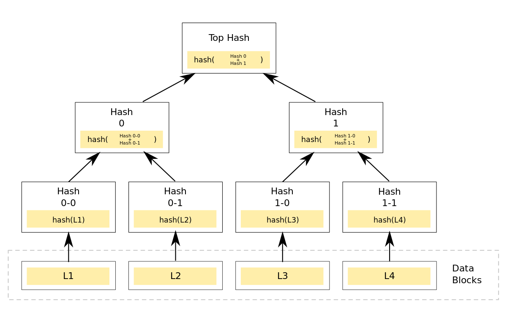

# Merkle tree

## Introduction to Merkle tree

A Merkle tree is a tree in which leaves of the tree are hashed in couples. So the hashes of L1 and L2 are hashed together, and the hashes of L3 and L4 get hashed together. Then the process is recursively applied to those hashes, until only 1 hash value is left, the Root of the tree. It is mostly visualized using an upside-down tree, with the Root at the top, branches coming down, and the leaves at the bottom. Using a Merkle tree, it is efficient to verify if a specific data point is part of the full tree. For more information on Merkle trees in general, visit [Wikipedia](https://en.wikipedia.org/wiki/Merkle_tree).

## Merkle tree and Network Security

Many blockchains use Merkle trees to efficiently secure the transactions each block contains. Since every transaction has an effect on the final hash value of the root of the Merkle tree, changing any transaction in the block will totally change the value of the Merkle tree's root hash. Therefore by only storing and validating the Root Hash of the Merkle tree, the full list of transactions can be validated. This could of course be achieved with any hash operation on all transactions. There are more advantages to using a Merkle tree, one of them can be found in Simplified Payment Verification (SPV), where the time required to validate that a transaction is part of a block can be drastically reduced thanks to the use of Merkle trees.
